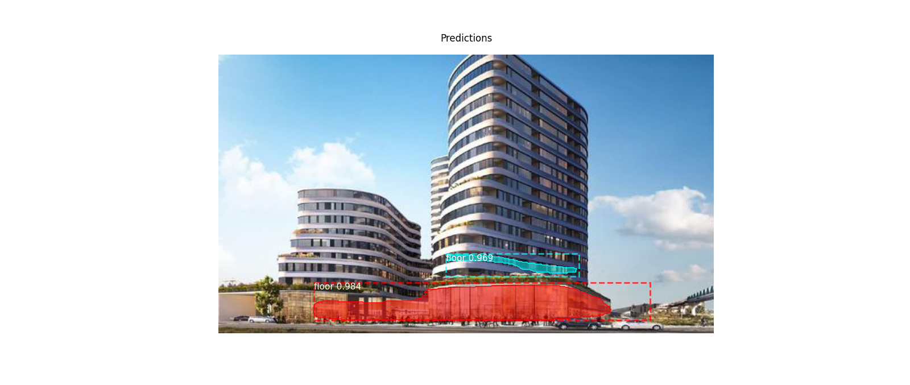

Data Preparation
Use http://www.robots.ox.ac.uk/~vgg/software/via/via-1.0.6.html to label data and export in json.


## Train

Put `mask_rcnn_coco.h5` under the project root directory and run below command.
```
python3 floor.py train --dataset=/path/to/your/dataset --weights=coco
```
The model will be generated under <project_root_dir>/logs. Use this model or a pretrained model for the next step.

## Detect
```
python3 floor.py detect --weights=/path/to/model --image=/path/to/the/image/to/detect --dataset=/path/to/your/dataset
```

## Result
